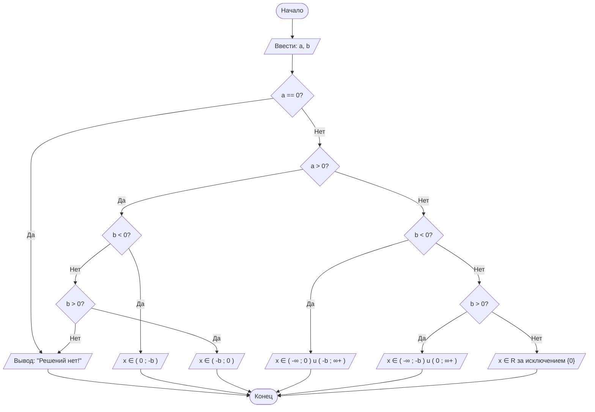

# LabN1
## Отчет по лабораторной работе № 1

#### № группы: `ПМ-2402`

#### Выполнил: `Савушкин Павел Павлович`

#### Вариант: `21`

### Cодержание:

- [Постановка задачи](#1-постановка-задачи)
- [Входные и выходные данные](#2-входные-и-выходные-данные)
- [Выбор структуры данных](#3-выбор-структуры-данных)
- [Алгоритм](#4-алгоритм)
- [Блок-схема](#5-блок-схема)
- [Программа](#6-программа)
- [Анализ правильности решения](#7-анализ-правильности-решения)

### 1. Постановка задачи

- Условия задачи

> Необходимо решить квадратное неравенство относительно неизвестной `x` (т.к. задано неравенство, то ответом будет некий промежуток, в котором существует `x`) . Программа получает на вход 2 числа (a и b), которые не превышают по модулю 2^32(Например, 10^9. Ограничение числа может быть вызвано разрядностью процессора (32 бита или "типично" 64) и настройками виртуальной машины Java). Нам следует обращать внимание на знаки a и b (от них зависит ответ).
>Неравенство:    a/(x(x+b))<0

- Поставленную задачу можно разбить на несколько подзадач:
-   1. `a = 0`. Если вводимое число a равно нулю, то рассматривать дальше неравенство ради поиска интервала бессмысленно, т.к. решений не будет (Такой же результат будет при a > 0 и b = 0). Пусть `a!=0`. Тогда для 2 подзадачи нужно также рассмотреть 2 случая, которые впоследствии разбиваются еще на 2 подслучая:
    1. `a > 0`. Следовательно, нам нужно далее рассмотреть `b > 0` , `b < 0` и `b = 0`для определения интервала.
    2. `a < 0` (По аналогии с 2.1)

### 2. Входные и выходные данные

#### Данные на вход

На вход программа должна получать 2 числа, при этом в условии не сказано, к какому множеству
принадлежать получаемые числа, поэтому будем считать их вещественными. 

|             | Тип                | min значение    | max значение   |
|-------------|--------------------|-----------------|----------------|
| a (Число 1) | Вещественное число | -10<sup>9</sup> | 10<sup>9</sup> |
| b (Число 2) | Вещественное число | -10<sup>9</sup> | 10<sup>9</sup> |

#### Данные на выход

Т.к. программа должна вывести интервал, в котором существует `x`, то на выводе программа будет выводить строку, используя оператор `+`, чтобы объединить несколько строк и числовых значений в одну строку. Но заметим, что при вычислениях нет операций над числом (умножения, деления и тд), поэтому оставляем min и max значения прежними. На выход может быть выведено 2 разных ответа (если смотреть по количеству чисел в сумме: одно или два). Но все они - вещественные.

|         | Тип                | min значение  | max значение  |
|---------|--------------------|---------------|---------------|
| Числа   | Вещественное число |-10<sup>9</sup>|10<sup>9</sup> |
| Строка  | String             |       -       |       -       |

### 3. Выбор структуры данных

Программа получает 2 вещественных числа, не превышающих по модулю 10<sup>9</sup>. Поэтому для их хранения
можно выделить 2 переменных (`a` и `b`) типа `double`. Также будет введена одна переменная `x0`, которая будет всегда равна 0. Я указал для нее тип `double`, чтобы при выводе она была такого же типа как `a` и `b`.

|             | название переменной | Тип (в Java) | 
|-------------|---------------------|--------------|
| a (Число 1) | `a`                 | `double`     |
| b (Число 2) | `b`                 | `double`     | 
| x0 (Число 3)| `x0`                | `double`     |


### 4. Алгоритм

#### Алгоритм выполнения программы:

1. **Ввод данных:**  
   Программа сначала считывает два значения: a и b. Для этого используется метод nextDouble() класса Scanner.

2. **Проверка условий:**  
   Программа проверяет знаки коэффициентов a и b. Например, случай, когда a равно 0. Если a равно 0, программа выводит сообщение "Решений нет!", так как уравнение не имеет решений (Аналогичный результат программа выведет при a > 0 и b = 0).

3. **Вычисление интервалов:**
    Затем программа проверяет знак коэффициента a и, в зависимости от этого, решает, какие интервалы следует выводить.
-    1. Если a > 0 и b > 0, то решением будет интервал (−b, 0).
-    2. Если a > 0 и b < 0, то решением будет интервал (0, -b).
     3. Если a < 0 и b > 0, то решение будет представлено как объединение двух интервалов: (−∞, −b) u (0, ∞+).
     4. Если a < 0 и b < 0, то решение будет представлено как объединение двух интервалов: (−∞, 0) u (-b, ∞+).
     5. Если a < 0 и b = 0, то программа выведет строку: x ∈ R за исключением {0}.

4. **Вывод результата:**  
   На экран выводится один из интервалов из пункта 4.3 (или строка "Решений нет!" при необходимых условиях)


### 5. Блок-схема




### 6. Программа

```java
import java.io.PrintStream;
import java.util.Scanner;
public class Main {
    // Объявляем объект класса PrintStream для вывода данных
    public static PrintStream out = System.out;
    // Объявляем объект класса Scanner для ввода данных
    public static Scanner in = new Scanner(System.in);
    public static void main(String[] args) {
        // Считывание двух вещественных чисел a и b из консоли
        double a = in.nextDouble();
        double b = in.nextDouble();
        // Вводим вещественную переменную x0, равную 0. Из неравенства следует ОДЗ (знаменатель не равен 0)
        // x(x+b)!=0 => x!=0 и x!=-b. "0" Всегда будет в решении (кроме случае a=0 и/или b=0)
        double x0 = 0;
        //Случай a=0
        if (a == 0){
            out.println("Решений нет!");
        }else{
            //Определяем знак вводимого числа a
            if (a>0){
                if (b<0){
                    //Определяем знак вводимого числа b при условии, что a>0
                    //Выводим нужный интервал, используя метод интервалов
                    out.print("x ∈ ( "+ x0 + " ; " + -b + " )"); // x(x-b)<0
                }else{
                    if (b>0)
                        out.print("x ∈ ( "+ -b + " ; " + x0 + " )"); // x(x+b)<0
                    else
                        out.println("Решений нет!");
                }
            }else{
                //Определяем знак вводимого числа b при условии, что a<0
                //Выводим нужный интервал
                if (b<0){
                    out.print("x ∈ ( -∞ ; " + x0 + " ) u ( " + -b + " ; ∞+ )");   // x(x-b)>0

                }else{
                    if (b>0)
                        out.print("x ∈ ( -∞ ; "+ -b + " ) u ( " + x0 + " ; ∞+ )");  // x(x+b)>0
                    else
                        out.print("x ∈ R за исключением {0}"); // a/ x^2 < 0
                }
            }
        }
    }
}

```

### 7. Анализ правильности решения

Привести тесты и анализ работы программы для этих тестов.
Очень неплохо было бы обосновать выбор тестов.

1. Тест на a>0 и b<0:
    
   -**Input**:
        ```
        2
        -3
        ```
    
    -**Output**:
        ```
        x ∈ ( 0.0 ; 3.0 )
        ```

2. Тест на a<0 и b>0:
    
    -**Input**:
        ```
        -1
        1
        ```
    
    -**Output**:
        ```
        x ∈ ( -∞ ; -1.0 ) u ( 0.0 ; ∞+ )
        ```
3. Тест на a>0 и b>0:
    
    -**Input**:
        ```
        100
        25
        ```
    
    -**Output**:
        ```
        x ∈ ( -25.0 ; 0.0 )
        ```

4. Тест на a<0 и b<0:
    
    -**Input**:
        ```
        -18
        -5
        ```
    
    -**Output**:
        ```
        x ∈ ( -∞ ; 0.0 ) u ( 5.0 ; ∞+ )
        ```
5. Тест на a=0, b - любое число:
    
    -**Input**:
        ```
        0
        1
        ```
    
   -**Output**:
        ```
        Решений нет!
        ```
6. Тест на a < 0 , b = 0 :

    -**Input**:
        ```
        -7
        0
        ```

   -**Output**:
        ```
        x ∈ R за исключением {0}
        ```
7. Тест на a > 0 , b = 0 :

    -**Input**:
        ```
        7
        0
        ```

   -**Output**:
        ```
        Решений нет!
        ```
8. Тест на ограничение задачи:

   -**Input**:
        ```
        1000000000 -1000000000
        ```

   -**Output**:
        ```
        x ∈ ( 0.0 ; 1.0E9 )
        ```
